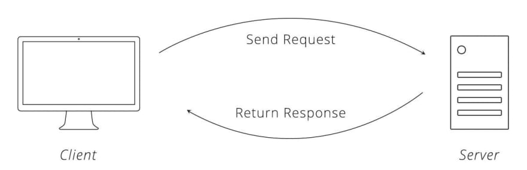

# APIs and Fetch

## Objectives

By the end of this talk, developers should be able to:

-   Define AJAX and what the abbreviation stands for
-   Describe the purpose of AJAX
-   Utilize AJAX to fetch data from third-party APIs
-   Talk about the place of AJAX in the request-response cycle
-   Describe how promises work in the context of AJAX requests

## Request Response Cycle

How we comunicate over the web is through something called the request and response
cycle. The simplist way to model this is a `client` sends a `request` to a `server`
and the `server` sends a `response`. We will be focused on sending a `request` and
receiving a `response` in this lesson.

### Examples of Clients

Clients are not just web browsers (Chrome). They can also be a number of things:

- Postman
- Insomnia 
- Another `server` or `api`
- cURL

## Sending a Request

To send a request from a client there are a couple of pieces we need to work with. This
will be true across all clients. First we have to we have to use a URL to make a request
to. A URL has many parts: `scheme`, `authority`, `path to resource`, `parameters`, and `anchor`.

### Parts of a URL

Uniform Resource Locator or URL is nothing more than an address on the web. Think of this
as an absolute path for a website but instead of it being on your local machine it's across
the entire web.

#### Scheme - HTTP

The `scheme` indicates what protocol to use to request a resource. Most protocols are either
HTTPS (secured) or HTTP (unsecured). But browser clients can handle other protocols like `mailto:`.

#### Authority

The authority has the `domain name` and an optional `port` section. The `domain name` indicates
the web server the request is being made to. The optional `port` indicated the gate used to access
a resource on a web server. 

#### Path to Resource

This is a path to the resource on a web server. Currently this is an abstract way to handle
requests but once this was an absoulte path on a web server.

#### Parameters

These are key/value pairs that a web server can accept as data.

#### Anchor

An anchor represents a content location in a document. In HTML, for example, you can anchor
to an element and the page will scroll to that element on load.

### Fetch 

There are many technologies that allow a client to make a request but for this lesson we will
focus on the Fetch API. Fetch API allows browsers to make requests to APIs and handle responses.
For full details on the Fetch API visit [here](https://developer.mozilla.org/en-US/docs/Web/API/Fetch_API/Using_Fetch).

## Receving a Response

When receive a response most of the time we will get back something that we are unable to work with
right off the bat. We are going to have to change that data into something we can work with called
JavaScript Object Notation or JSON.

JSON is a way we send and reveice data over the web. Once JSON was apart of JavaScript but over time
it has become its own full lightweight data-interchange format.

## Additional Resources

- [What is a URL](https://developer.mozilla.org/en-US/docs/Learn/Common_questions/What_is_a_URL)
- [HTTP and the Request-Response Cycle](https://medium.com/geekculture/http-the-request-response-cycle-ddcb5bb70707)

## [License](LICENSE)

1.  All content is licensed under a CC­BY­NC­SA 4.0 license.
2.  All software code is licensed under GNU GPLv3. For commercial use or
    alternative licensing, please contact legal@ga.co.