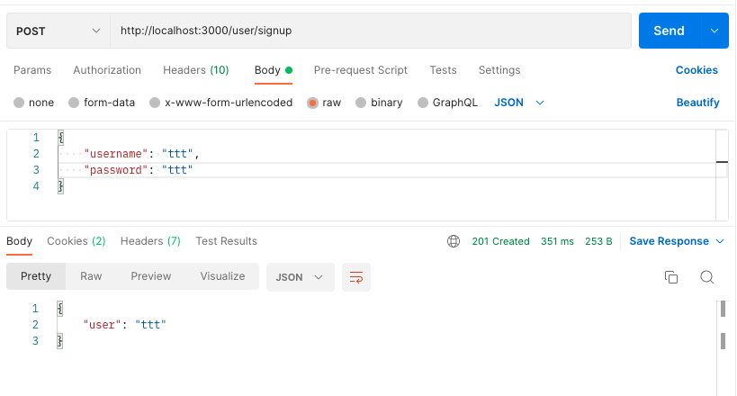
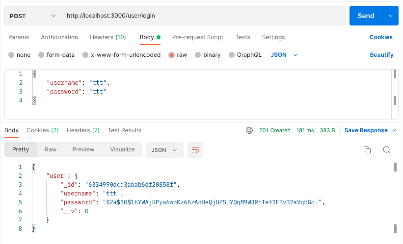
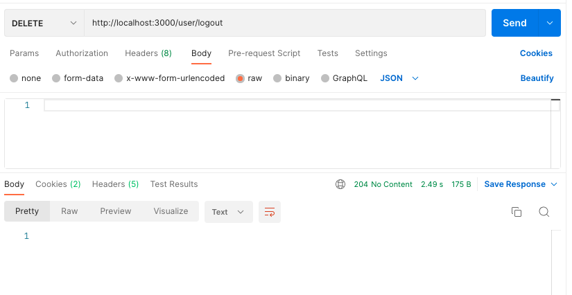

[](https://generalassemb.ly/education/web-development-immersive)

# Mongoose - Authentication, Authorization, and Relationships

## Refactoring Fruits App - Organizing and Adding Authentication/Authorization

## Let's make it better

Right now we have all our server logic inside server.js, this is easier when we are developing alone but can quickly become a mess as the code base and development team gets bigger. We should always seek to separate concerns, meaning moving the different pieces of our application into their own files and folders. We already have a directory called `models` where our Fruit model lives, so let's start setting up our project to have a more MVC structure.

#### Move the connection

- inside the directory called models, create a file called connection.js

- move our connection code from server.js to models/connection.js

```js
/////////////////////////////////////////////
// Import Our Dependencies
/////////////////////////////////////////////
require("dotenv").config() // Load ENV Variables
const mongoose = require("mongoose")

/////////////////////////////////////////////
// Database Connection
/////////////////////////////////////////////
// Setup inputs for our connect function
const DATABASE_URL = process.env.DATABASE_URL
const CONFIG = {
  useNewUrlParser: true,
  useUnifiedTopology: true,
}

// Establish Connection
mongoose.connect(DATABASE_URL, CONFIG)

// Events for when connection opens/disconnects/errors
mongoose.connection
  .on("open", () => console.log("Connected to Mongoose"))
  .on("close", () => console.log("Disconnected from Mongoose"))
  .on("error", (error) => console.log(error))

////////////////////////////////////////////////////
// Export the Connection
////////////////////////////////////////////////////

module.exports = mongoose
```

So now import the model where it is used (currently server.js)...

```js
/////////////////////////////////////////////
// Import Our Dependencies
/////////////////////////////////////////////
require("dotenv").config() // Load ENV Variables
const express = require("express") // import express
const morgan = require("morgan") //import morgan
const Fruit = require("./models/fruit")
```

Our server.js is already starting to look a lot cleaner!

## Continue Refactoring - Move the fruit routes into a controller/router

It'll organize and speed up our application to bundle our related routes into routers, typically routes that share the same prefix/namespace. In this case we have several routes that start with `/fruits/` we can bundle all these into one router.

- make a folder called controllers and in that folder make a fruit.js

- let's import express and create a router in that file, then export that router

```js
////////////////////////////////////////
// Import Dependencies
////////////////////////////////////////
const express = require("express")
const Fruit = require("../models/fruit")

/////////////////////////////////////////
// Create Route
/////////////////////////////////////////
const router = express.Router()

/////////////////////////////////////////
// Routes
/////////////////////////////////////////

//////////////////////////////////////////
// Export the Router
//////////////////////////////////////////
module.exports = router
```

- Now copy over all our fruits routes from server.js to the routes section of our controller

- change each reference to `app` to `router`

- remove the `/fruits/` from the endpoint, we'll define this when we register the router

```js
////////////////////////////////////////
// Import Dependencies
////////////////////////////////////////
const express = require("express")
const Fruit = require("../models/fruit")

/////////////////////////////////////////
// Create Route
/////////////////////////////////////////
const router = express.Router()

/////////////////////////////////////////
// Routes
/////////////////////////////////////////

router.get("/fruits/seed", (req, res) => {
  // array of starter fruits
  const startFruits = [
    { name: "Orange", color: "orange", readyToEat: false },
    { name: "Grape", color: "purple", readyToEat: false },
    { name: "Banana", color: "orange", readyToEat: false },
    { name: "Strawberry", color: "red", readyToEat: false },
    { name: "Coconut", color: "brown", readyToEat: false },
  ]

  // Delete all fruits
  Fruit.deleteMany({}).then((data) => {
    // Seed Starter Fruits
    Fruit.create(startFruits)
      .then((data) => {
      // send created fruits as response to confirm creation
        res.json(data)
      })
  })
})

// index route
router.get("/fruits", (req, res) => {
  // find all the fruits
  Fruit.find({})
    // render a template after they are found
    .then((fruits) => {
      // send any fruits found in the db as json
      res.json({ fruits: fruits })
      // You can also use res.status and chain on the json method, like this:
      // res.status(200).json({ fruits: fruits })
    })
    // send error as json if they aren't
    .catch((error) => {
      res.json({ error })
    })
})

// create route
router.post("/fruits", (req, res) => {
  // check if the readyToEat property should be true or false
  // we'll uncomment this line later when we're using the browser.
  // req.body.readyToEat = req.body.readyToEat === "on" ? true : false
  // create the new fruit
  Fruit.create(req.body)
    .then((fruit) => {
      // send user 201 Created message and the newly created fruit.
      res.status(201).json({ fruit: fruit.toObject() })
    })
    // send error as json
    .catch((error) => {
      console.log(error)
      res.json({ error })
    })
})

//update route
routerput("/fruits/:id", (req, res) => {
  // get the id from params
  const id = req.params.id
  // check if the readyToEat property should be true or false, checkboxes send the value "on", which we're checking for here and changing the value to either true or false.
  req.body.readyToEat = req.body.readyToEat === "on" ? true : false
  // find and update the fruit
  Fruit.findByIdAndUpdate(id, req.body, { new: true })
    .then((fruit) => {
      // send status of 204 no content
      // res.sendStatus() another method you can use
      res.sendStatus(204)
    })
    // send error as json
    .catch((error) => {
      console.log(error)
      res.json({ error })
    })
})

router.delete("/fruits/:id", (req, res) => {
  // get the id from params
  const id = req.params.id
  // find and delete the fruit
  Fruit.findByIdAndRemove(id)
    .then((fruit) => {
      // 204 - No Content
      res.sendStatus(204)
    })
    // send error as json
    .catch((error) => {
      // console.log(error)
      res.json({ error })
    })
})

// show route
router.get("/:id", (req, res) => {
  // get the id from params
  const id = req.params.id

  // find the particular fruit from the database
  Fruit.findById(id)
    .then((fruit) => {
      console.log(fruit)
      res.json({ fruit: fruit })
    })
    .catch((error) => {
      console.log(error)
      res.json({ error })
    })
})

//////////////////////////////////////////
// Export the Router
//////////////////////////////////////////
module.exports = router
```

Your app should now be working just like it was before but now should be more organized. Notice all the pieces for fruits have been broken down into MVC.

- `models/fruit.js` - handles the getting the database connection and defining the fruit model (share of data)

- `controllers/fruit.js` - creates all our routes which pull data from the model and sends them over to the templates

Essentially we just repeat this pattern for each category of functionality we want to add to our app.

## Creating and Using a Seed File

Seed routes are great convienient but you do run the risk of forgetting to remove the route before releasing the app creating a way a user can just reset your app, even if by accident. May be safer to seed your database in a non-route so only you can seed the database. This is usually dont by creating a seperate file that can be run as a script where you can put any database code you like.

- create a `models/seed.js` file

```js
///////////////////////////////////////
// Import Dependencies
///////////////////////////////////////
const mongoose = require('./connection')
const Fruit = require('./fruit')

///////////////////////////////////////////
// Seed Code
////////////////////////////////////////////
// save the connection in a variable
const db = mongoose.connection
console.log('db in seed', db)
db.on('open', () => {
	// array of starter fruits
	const startFruits = [
		{ name: 'Orange', color: 'orange', readyToEat: false },
		{ name: 'Grape', color: 'purple', readyToEat: false },
		{ name: 'Banana', color: 'orange', readyToEat: false },
		{ name: 'Strawberry', color: 'red', readyToEat: false },
		{ name: 'Coconut', color: 'brown', readyToEat: false },
	]

	// when we seed data, there are a few steps involved
	// delete all the data that already exists(will only happen if data exists)
	Fruit.remove({})
        .then(deletedFruits => {
		    console.log('this is what remove returns', deletedFruits)
		    // then we create with our seed data
            Fruit.create(startFruits)
                .then((data) => {
                    console.log('Here are the new seed fruits', data)
                    db.close()
                })
                .catch(error => {
                    console.log(error)
                    db.close()
                })
	    })
        .catch(error => {
            console.log(error)
            db.close()
        })
})
```

Let's write a script in package.json that will run this file for us

```js
  "scripts": {
    "start": "nodemon server.js"
    "seed": "node models/seed.js"
  },
```

Now we can run our seed with `npm run seed`

## Adding Session Based Authentication

Let's define some terms

- Authentication: Proving the user exists usually with a password (logging in)
- Authorization: Checking if the logged in user is allowed to use the specified resource

**Authentication**

This is typically done by comparing a password a user has entered with one they provided at signup. The only wrinkle is for security purposes we will want to encrypt the password using something called bCrypt.

**Authorization**

There are two main ways to achieve this:

- Session Based Auth: This is a better choice if all resources the logged in user needs to access is on the same backend server. In this scenario a user logs in and a cookie is created for the browser session (until they close the browser or logout). This cookie will identify a tiny packet of data on our server we can then access with anything we'd like to store in it like the users login status or user information.

_The data is on the server, the cookie allows us to know which data belongs to which logged in user._

- JWT Token based Auth: This is a better choice for API and applications split accross multiple servers. Instead of saving the data on the server, the data is encoded into a token that each server knows how to decode. When accessing protected resources on the server the token must be presented. If the server can successfully decode the token then the user must be logged in, and the users info will be payload inside the decoded token.

_The data is on the token, the token proves we are logged in and contains our info in the browser not the server_

For our particular app, session based auth will be the better pattern. In units 3 & 4 where we will build APIs, JWT tokens will be the better way to do it.

#### Authorization

- Let's install some dependencies `npm install bcryptjs express-session connect-mongo`

  - bcryptjs: a pre-compiled version of bcrypt which we will use to encrypt passwords

  - express-session: middleware for creating session cookies

  - connect-mongo: plugin that will allow express session to save session data in our mongo database

**CREATE USER MODEL**

create `model/user.js`

```js
//////////////////////////////////////////////
// Import Dependencies
//////////////////////////////////////////////
const mongoose = require("./connection")

////////////////////////////////////////////////
// Define Model
////////////////////////////////////////////////
// pull schema and model from mongoose
const { Schema, model } = mongoose

// make fruits schema
const userSchema = new Schema({
  username: { type: String, required: true, unique: true },
  password: { type: String, required: true },
})

// make fruit model
const User = model("User", userSchema)

///////////////////////////////////////////////////
// Export Model
///////////////////////////////////////////////////
module.exports = User
```

**Create a User Controller**

- create `controllers/user.js`

```js
////////////////////////////////////////
// Import Dependencies
////////////////////////////////////////
const express = require("express")
const User = require("../models/user")
const bcrypt = require("bcryptjs")

/////////////////////////////////////////
// Create Route
/////////////////////////////////////////
const router = express.Router()

/////////////////////////////////////////
// Routes
/////////////////////////////////////////

// The Signup Routes (Get => form, post => submit form)
// post to send the signup info
router.post('/signup', async (req, res) => {
    console.log('this is initial req.body in signup', req.body)
    // first encrypt our password
    req.body.password = await bcrypt.hash(
        req.body.password, 
        await bcrypt.genSalt(10)
    )
    // console.log('req.body after hash', req.body)
    // create a new user
    User.create(req.body)
        // if created successfully redirect to login
        .then(user => {
            // res.redirect('/user/login')
            res.status(201).json({ username: user.username })
        })
        // if an error occurs, send err
        .catch(error => {
            console.log(error)
            res.json(error)
        })
})

// The login Routes (Get => form, post => submit form)
router.post('/login', async (req, res) => {
    // console.log('request object', req)
    // get the data from the request body
    const { username, password } = req.body
    // then we search for the user
    User.findOne({ username })
        .then(async (user) => {
            // check if the user exists
            if (user) {
                // compare the password
                // bcrypt.compare evaluates to a truthy or a falsy value
                const result = await bcrypt.compare(password, user.password)
                // If our bcrypt is successful, it'll turn result into a truthy value, in which case we can proceed by creating the session.
                if (result) {
                    // then we'll need to use the session object
                    // store some properties in the session
                    req.session.username = username
                    req.session.loggedIn = true
                    req.session.userId = user.id

                    console.log('session user id', req.session.userId)
                    // We can send a 201 status and the user as json
                    // we'll change this later for security purposes, but for now, we can just look at the whole user.
                    res.status(201).json({ user: user.toObject() })
                } else {
                    // send an error if the password doesnt match
                    res.json({ error: 'username or password incorrect'})

                }
            } else {
                // send an error if the user doesnt exist
                res.json({ error: 'user does not exist' })
            }
        })
        // catch any other errors that occur
        .catch(error => {
            console.log(error)
            res.json(error)
        })
})

// logout route -> destroy the session
router.delete('/logout', (req, res) => {
    // destroy the session
    req.session.destroy(err => {
        console.log('this is err in logout', err)
        // res.redirect('/')
        // if we want, we can send a message and a status of 200
        // upon successful logout, we can send the status and a message
        // res.status(200).json({ message: 'You are now logged out'})
        // OR, what's more common, is to use a 204 status with no content
        res.sendStatus(204)
    })
})

//////////////////////////////////////////
// Export the Router
//////////////////////////////////////////
module.exports = router
```

- connect the router to server.js

```js
/////////////////////////////////////////////
// Import Our Dependencies
/////////////////////////////////////////////
require("dotenv").config() // Load ENV Variables
const express = require("express") // import express
const morgan = require("morgan") //import morgan
const path = require("path")
const FruitRouter = require("./controllers/fruit")
const UserRouter = require("./controllers/user")

/////////////////////////////////////////////////
// Create our Express Application Object
/////////////////////////////////////////////////
const app = express()

/////////////////////////////////////////////////////
// Middleware
/////////////////////////////////////////////////////
app.use(morgan("tiny")) //logging
app.use(express.urlencoded({ extended: true })) // parse urlencoded request bodies
app.use(express.static("public")) // serve files from public statically
app.use(express.json()) // parses incoming requests with JSON payloads
////////////////////////////////////////////
// Routes
////////////////////////////////////////////

app.use("/fruits", FruitRouter) // send all "/fruits" routes to fruit router
app.use("/user", UserRouter) // send all "/user" routes to user router

app.get("/", (req, res) => {
  res.send("your server is running... better catch it.")
})
```

## Testing Auth Routes in Postman

Now that we have our routes set up, let's test them in postman!

#### Sign Up



#### Log In



#### Log Out



## Relationships

Everything we've done up to now has been for the sake of providing a way to prove the current user is the person who owns the account, and any of the account's owned resources. In this section, we'll look at the ways we can relate the resources(models) of our application. 

We can build relationships between models by defining them in the model's schema. We're going to add ownership to our fruits using a foreign key `reference`. Then, we'll add comments to fruits using `subdocuments`

### References

Let's add an `owner` field to our fruit schema, the value for owner will be a user document's `objectId`, the unique identifier of that instance of a user in your mongoDb.

```js
// we'll import our user model so we can populate the info later.
const User = require('./user')
const { Schema, model } = mongoose

// make our fruits schema
const fruitSchema = new Schema({
    name: { type: String },
    color: { type: String },
    readyToEat: { type: Boolean },
    // we're going to use a reference to the user's id
    owner: {
        // references the type 'ObjectId', the  `._id` of a user.
        type: Schema.Types.ObjectId,
        // references the model: 'User'
        ref: 'User'
    }
}, { timestamps: true })

// make our fruit model
const Fruit = model("Fruit", fruitSchema)

/////////////////////////////////
// Export our Model
/////////////////////////////////
module.exports = Fruit
```
Now that we have an owner for our fruits, let's start using them. Next, we need to update our controllers to provide a value for the owner field when we create a fruit. This value will be retrieved from the session object we create when a user logs in.

```js
// create -> POST
router.post('/', (req, res) => {

  // we're ready for mongoose to do its thing
  // now that we have user specific fruits, 
  // we'll add the owner to the fruit from the request body.
  // Since we've stored the id of the user in the session object, we can use it to set the owner property of the fruit upon creation.
  req.body.owner = req.session.userId
  console.log('this is req.body before adding owner', req.body)
  Fruit.create(req.body)
    .then((fruit) => {
      console.log('this was returned from create', fruit)
      res.status(201).json({ fruit: fruit.toObject() })
    })
    .catch((err) => {
      console.log(err)
      res.json({ err })
    })
})
```

Try your login, then your create route in postman and look at the difference!

Now that we have an owner, let's make sure our update and delete routes can only be utilized by the logged in user.

```js
router.put('/:id', (req, res) => {
	// get the id from the request url
	const fruitId = req.params.id
	// tell mongoose to update the fruit
	Fruit.findById(fruitId)
    .then(fruit => {
      if (fruit.owner == req.session.userId) {
        return fruit.updateOne(req.body)
      }
    })
		// if successful -> send status
		.then(fruit => {
			console.log('the updated fruit', fruit)
			res.sendStatus(204)
		})
		// if an error, display that
		.catch((error) => res.json(error))
})

// delete route
router.delete('/:id', (req, res) => {
  // get the fruit id
	const fruitId = req.params.id
	// delete the fruit
	Fruit.findById(fruitId)
    .then(fruit => {
      if (fruit.owner == req.session.userId) {
        return fruit.deleteOne()
      }
    })
		.then(() => {
			res.sendStatus(204)
		})
		.catch((error) => {
      console.log(error)
			res.json({ error })
		})
})
```

Now we've protected our resources so that only authenticated users may update or delete their own fruits.

### Subdocuments

In this section, we're going to add comments to our Fruit `model` using subdocuments. Subdocuments are schemas that you can define to create documents which only exist in association with a `model`. Subdocuments are not like `model` references, (even though they have their own id) and they aren't accessed using `model` methods. Let's create a schema for our comments, then add them to the Fruit `model`. Even though they aren't _technically_ models, we'll still keep our schema in the models directory.

Make a new file in the models directory called `comment.js`, and add this:

```js
/////////////////////////////////
// import dependencies
/////////////////////////////////
const mongoose = require('./connection')

// here's an alternate syntax for creating a schema
// reminder: we do not need a model for a subdocument
// all we need is a schema 
const commentSchema = new mongoose.Schema({
    note: {
        type: String,
        required: true
    },
    author: {
        type: mongoose.Schema.Types.ObjectId,
        ref: 'User',
        required: true
    }
}, {
    timestamps: true
})

module.exports = commentSchema
```

So, here, our comment will be made of two parts, the note and the author. The author is another user reference, so we can protect access to changing or deleting the comments.

Also, notice how we're exporting the schema, __NOT__ a model like we do in `models/fruit.js`, let's go there now and add our subdocument:

```js
// paste this at the bottom of your dependencies
const commentSchema = require('./comment')

// paste this at the end of your fruitSchema, before the timestamps making sure to add a comma after the owner definition.
comments: [commentSchema]
```

Now, when you run an index request, you'll see an empty array as the value for comments. Next, we'll build a new controller specifically for comments.

```js
////////////////////////////////////////////
// Import Dependencies
////////////////////////////////////////////
const express = require('express')
const mongoose = require('mongoose')

const router = express.Router()

// we need our Fruit MODEL because comments are ONLY a schema
// so we'll run queries on fruits, and add in comments
const Fruit = require('../models/fruit')

////////////////////////////////////////////
// Routes
////////////////////////////////////////////
// only need two routes for comments right now
// POST -> to create a comment
router.post('/:fruitId', (req, res) => {
    const fruitId = req.params.fruitId
    console.log('first comment body', req.body)
    
    // we'll adjust req.body to include an author
    // the author's id will be the logged in user's id
    req.body.author = req.session.userId
    console.log('updated comment body', req.body)
    // we'll find the fruit with the fruitId
    Fruit.findById(fruitId)
        .then(fruit => {
            // then we'll send req.body to the comments array
            fruit.comments.push(req.body)
            // save the fruit
            return fruit.save()
        })
        .then(fruit => {
            // redirect
            // res.redirect(`/fruits/${fruit.id}`)
            res.status(201).json({ fruit: fruit })
        })
        // or show an error if we have one
        .catch(error => {
            console.log(error)
            res.send(error)
        })
})

// DELETE -> to destroy a comment
// we'll use two params to make our life easier
// first the id of the fruit, since we need to find it
// then the id of the comment, since we want to delete it
router.delete('/delete/:fruitId/:commId', (req, res) => {
    // first we want to parse out our ids
    const fruitId = req.params.fruitId
    const commId = req.params.commId
    // then we'll find the fruit
    Fruit.findById(fruitId)
        .then(fruit => {
            const theComment = fruit.comments.id(commId)
            // only delete the comment if the user who is logged in is the comment's author
            if ( theComment.author == req.session.userId) {
                // then we'll delete the comment
                theComment.remove()
                // return the saved fruit
                return fruit.save()
            } else {
                return
            }

        })
        .then(fruit => {
            console.log('updated fruit', fruit)
            res.sendStatus(204)
        })
        .catch(error => {
            // catch any errors
            console.log(error)
            res.send(error)
        })
})

////////////////////////////////////////////
// Export the Router
////////////////////////////////////////////
module.exports = router
```

### .populate()

The neat thing about id references, is that you can call the populate method on any id reference and get the entire referenced object back! Check out how we can get the user model associated with all the comments' authors below using the `.populate()` method.

```js
// show route
router.get('/:id', (req, res) => {
  // first, we need to get the id
  const fruitId = req.params.id
  // then we can find a fruit by its id
  Fruit.findById(fruitId)
    .populate('comments.author')
    // once found, we can render a view with the data
    .then((fruit) => {
      console.log('the fruit we got\n', fruit)
      const username = req.session.username
      const loggedIn = req.session.loggedIn
      const userId = req.session.userId
      // res.render('fruits/show', { fruit, username, loggedIn, userId })
      res.status(200).json({ fruit: fruit.toObject() })
    })
    // if there is an error, show that instead
    .catch((err) => {
      console.log(err)
      res.json({ err })
    })
})
```
## Additional Resources

-   [Express Session npm](https://www.npmjs.com/package/express-session)
-   [bcryptjs](https://www.npmjs.com/package/bcryptjs)
-   [connect-mongo](https://www.npmjs.com/package/connect-mongo)

## [License](LICENSE)

1.  All content is licensed under a CC­BY­NC­SA 4.0 license.
1.  All software code is licensed under GNU GPLv3. For commercial use or
    alternative licensing, please contact legal@ga.co.
