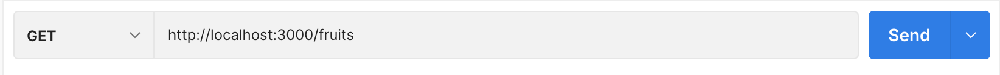
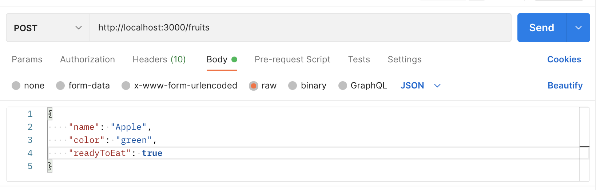
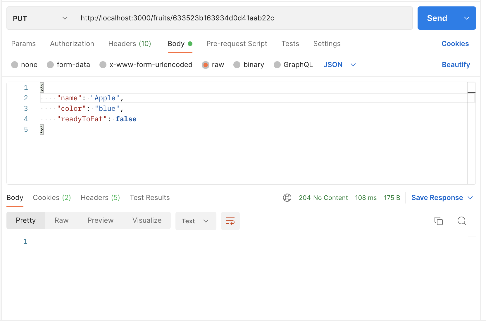

[](https://generalassemb.ly/education/web-development-immersive)

# Mongoose - Create, Read, Update & Delete Routes

## Prerequisites

-   MongoDb
-   Express
-   Mongoose

## Objectives

By the end of this, developers should be able to:

- Define middleware
- Create a complete set of CRUD routes for a REST API
- Test API routes with Postman
- Explain the difference between GET, POST, PUT, and DELETE requests
- Create a custom database seed script

## Mongoose Express CRUD

Here is where unit 2's material all comes together. We'll be building a full stack application using Express, Mongoose, and a view templating engine. We're going to start by building an API, and testing our routes with Postman. Today we'll cover basic CRUD functionality, eventually, we'll add in some relationships and authentication, and at the end we'll use the Liquid view templating engine so we can test everything in the browser.

## Setup

- create a new folder

- create a server.js `touch server.js`

- create a new npm project `npm init -y`

- install dependencies `npm install express mongoose dotenv morgan`

- install nodemon as a dev dependency `npm install --save-dev nodemon`

- setup the following scripts in package.json

```json
  "scripts": {
    "start": "nodemon server.js"
  },
```
- create a `.env` file with the following dependencies
```
DATABASE_URL=<use your mongodb url>
PORT=3000
```
- create a `.gitignore` file with the following (always a good habit to make one even if you have a global .gitignore, the global is there to catch you in case)

```
/node_modules
.env
```

## Setting Up Our server.js

`server.js` is the entry point to our application. This is the first file accessed when the app is run, consider it the "top level" of the application.

This is where we will import our dependencies, and register our middleware, routes, and server listener. We'll also use this file to connect to the database for now, but best practices will cause us to change this later.

### Import our dependencies

```js
/////////////////////////////////////////////
// Import Our Dependencies
/////////////////////////////////////////////
require("dotenv").config() // Load ENV Variables
const express = require("express") // import express
const morgan = require("morgan") // import morgan
const mongoose = require("mongoose") // import mongoose
const path = require("path") // import path module
```
### Summary of Dependencies

  - `dotenv` => will allow us to use a `.env` file to define environmental variables we can access via the `process.env` object
  - `express` => web framework for creating our server and writing routes
  - `morgan` => logs details about requests to our server, mainly to help us debug
  - `mongoose` => ODM for connecting to and sending queries to a mongo database
  - `path` => a module that provides utilities for working with file and directory paths

### Establish Database Connection

Here's where we will be connecting mongoose to our local mongoDb, we'll keep it in `server.js` for now, but will be moving it later in order to follow best practices.

DATABASE_URL is what we call an environment variable, these live in our .env, which gets ignored when pushing up our repository to github because we added it to `.gitignore`. This is the file we want to use to hold our sensitive information. 

```js
/////////////////////////////////////////////
// Database Connection
/////////////////////////////////////////////
// Setup inputs for our connect function
const DATABASE_URL = process.env.DATABASE_URL
const CONFIG = {
  useNewUrlParser: true,
  useUnifiedTopology: true,
}

// Establish Connection
mongoose.connect(DATABASE_URL, CONFIG)

// Events for when connection opens/disconnects/errors
mongoose.connection
  .on("open", () => console.log("Connected to Mongoose"))
  .on("close", () => console.log("Disconnected from Mongoose"))
  .on("error", (error) => console.log(error))
```

### Create Our Fruits Model

In a directory called 'models' create a file called `fruit.js`, inside that file, put the following code:

```js
////////////////////////////////////////////////
// Our Models
////////////////////////////////////////////////
// pull schema and model from mongoose
const { Schema, model } = mongoose

// make fruits schema
const fruitsSchema = new Schema({
  name: String,
  color: String,
  readyToEat: Boolean,
})

// make fruit model
const Fruit = model("Fruit", fruitsSchema)

///////////////////////////////////////////////////
// Export Model
///////////////////////////////////////////////////
module.exports = Fruit;
```

### Create App Object

```js
/////////////////////////////////////////////////
// Create our Express Application Object Bind Liquid Templating Engine
/////////////////////////////////////////////////
const app = express()
```

So now import the model where it is used (currently server.js)...

```js
/////////////////////////////////////////////
// Import Our Dependencies
/////////////////////////////////////////////
require("dotenv").config() // Load ENV Variables
const express = require("express") // import express
const morgan = require("morgan") //import morgan
const Fruit = require("./models/fruit")
```

### Register our Middleware

```js
/////////////////////////////////////////////////////
// Middleware
/////////////////////////////////////////////////////
app.use(morgan("tiny")) //logging
app.use(express.urlencoded({ extended: true })) // parse urlencoded request bodies
app.use(express.static("public")) // serve files from public statically
app.use(express.json()) // parses incoming requests with JSON payloads
```

### Our initial route

```js
////////////////////////////////////////////
// Routes
////////////////////////////////////////////
app.get("/", (req, res) => {
  res.send("your server is running... better catch it.")
})
```

### Server Listener

```js
//////////////////////////////////////////////
// Server Listener
//////////////////////////////////////////////
const PORT = process.env.PORT
app.listen(PORT, () => console.log(`Now Listening on port ${PORT}`))
```

### The complete server.js file

```js
/////////////////////////////////////////////
// Import Our Dependencies
/////////////////////////////////////////////
require("dotenv").config() // Load ENV Variables
const express = require("express") // import express
const morgan = require("morgan") //import morgan
const mongoose = require("mongoose")
const path = require("path")
const Fruit = require("./models/fruit")

/////////////////////////////////////////////
// Database Connection
/////////////////////////////////////////////
// Setup inputs for our connect function
const DATABASE_URL = process.env.DATABASE_URL
const CONFIG = {
  useNewUrlParser: true,
  useUnifiedTopology: true,
}

// Establish Connection
mongoose.connect(DATABASE_URL, CONFIG)

// Events for when connection opens/disconnects/errors
mongoose.connection
  .on("open", () => console.log("Connected to Mongoose"))
  .on("close", () => console.log("Disconnected from Mongoose"))
  .on("error", (error) => console.log(error))

/////////////////////////////////////////////////
// Create our Express Application Object
/////////////////////////////////////////////////
const app = express()

/////////////////////////////////////////////////////
// Middleware
/////////////////////////////////////////////////////
app.use(morgan("tiny")) //logging
app.use(express.urlencoded({ extended: true })) // parse urlencoded request bodies
app.use(express.static("public")) // serve files from public statically
app.use(express.json()) // parses incoming requests with JSON payloads

////////////////////////////////////////////
// Routes
////////////////////////////////////////////
app.get("/", (req, res) => {
  res.send("your server is running... better catch it.")
})

//////////////////////////////////////////////
// Server Listener
//////////////////////////////////////////////
const PORT = process.env.PORT
app.listen(PORT, () => console.log(`Now Listening on port ${PORT}`))
```

## models/fruit.js
```js
////////////////////////////////////////////////
// Our Models
////////////////////////////////////////////////
// pull schema and model from mongoose
const { Schema, model } = mongoose

// make fruits schema
const fruitsSchema = new Schema({
  name: String,
  color: String,
  readyToEat: Boolean,
})

// make fruit model
const Fruit = model("Fruit", fruitsSchema)
```

- run your server with `npm start`
- visit `localhost:3000` to see if our test route works

## Seeding Our Database

Before we build all our crud routes we should get some sample data in our database. There are two ways we can facilitate this:

- Seed Route: A route on our server when requested will delete everything in our database and re-seed it with some starter data
- Seed File: A script we can run (usually called seed.js) that'll empty and re-seed our database.

We'll create a seed route for now, later I'll also show you how to setup a seed file when we refactor the application later on.

Add This to your routes

```js
app.get("/fruits/seed", (req, res) => {
  // array of starter fruits
  const startFruits = [
    { name: "Orange", color: "orange", readyToEat: false },
    { name: "Grape", color: "purple", readyToEat: false },
    { name: "Banana", color: "orange", readyToEat: false },
    { name: "Strawberry", color: "red", readyToEat: false },
    { name: "Coconut", color: "brown", readyToEat: false },
  ]

  // Delete all fruits
  Fruit.deleteMany({}).then((data) => {
    // Seed Starter Fruits
    Fruit.create(startFruits)
      .then((data) => {
      // send created fruits as response to confirm creation
        res.json(data)
      })
  })
})
```

now we can use the url `/fruits/seed` as a reset button on our data, great for development. Keep in mind you would want to comment this out in production so users can't reset your data by accident.

## Index Route (Get => /fruits)

Mongoose allows you to write your queries in three ways

- using a callback (what you've done so far)
- using .then
- using async await

So here is how the route would look like all three ways:

#### The .then Method

```js
// index route
app.get("/fruits", (req, res) => {
  // find all the fruits
  Fruit.find({})
    // render a template after they are found
    .then((fruits) => {
      // send any fruits found in the db as json
      res.json({ fruits: fruits })
      // You can also use res.status and chain on the json method, like this:
      // res.status(200).json({ fruits: fruits })
    })
    // send error as json if they aren't
    .catch((error) => {
      res.json({ error })
    })
})
```

#### Callback Method

```js
// index route
app.get("/fruits", (req, res) => {
  Fruit.find({}, (err, fruits) => {
    res.json({ fruits: fruits })
  })
})
```

#### The Async/Await Method

```js
// index route
app.get("/fruits", async (req, res) => {
  const fruits = await Fruits.find({})
  res.json({ fruits: fruits })
})
```

Go to http://localhost:3000/fruits to see if our route works!

## Create Route (POST => /fruits)

- Let's build a route we can send data to, via a request body, and use that route to create an instance of the Fruit model using the mongoose model method `.create()`.

```js
// create route
app.post("/fruits", (req, res) => {
  // check if the readyToEat property should be true or false
  // we'll uncomment this line later when we're using the browser.
  // req.body.readyToEat = req.body.readyToEat === "on" ? true : false
  // create the new fruit
  Fruit.create(req.body)
    .then((fruit) => {
      // send user 201 Created message and the newly created fruit.
      res.status(201).json({ fruit: fruit.toObject() })
    })
    // send error as json
    .catch((error) => {
      console.log(error)
      res.json({ error })
    })
})
```

Now you should be able to add fruits! 

## Postman

We obviously don't have a form in the browser with which to send data, but we can use Postman to test out our routes. Open up Postman and test out our index route. 



You should receive the same json we saw in the browser as a response.

```json
{
    "fruits": [
        {
            "_id": "6334aecf8e3ab85534de24de",
            "name": "Orange",
            "color": "orange",
            "readyToEat": false,
            "createdAt": "2022-09-28T20:30:07.604Z",
            "updatedAt": "2022-09-28T20:30:07.604Z",
            "__v": 0
        },
        {
            "_id": "6334aecf8e3ab85534de24df",
            "name": "Grape",
            "color": "purple",
            "readyToEat": false,
            "createdAt": "2022-09-28T20:30:07.604Z",
            "updatedAt": "2022-09-28T20:30:07.604Z",
            "__v": 0
        },
        {
            "_id": "6334aecf8e3ab85534de24e0",
            "name": "Banana",
            "color": "orange",
            "readyToEat": false,
            "createdAt": "2022-09-28T20:30:07.604Z",
            "updatedAt": "2022-09-28T20:30:07.604Z",
            "__v": 0
        },
        {
            "_id": "6334aecf8e3ab85534de24e1",
            "name": "Strawberry",
            "color": "red",
            "readyToEat": false,
            "createdAt": "2022-09-28T20:30:07.604Z",
            "updatedAt": "2022-09-28T20:30:07.604Z",
            "__v": 0
        },
        {
            "_id": "6334aecf8e3ab85534de24e2",
            "name": "Coconut",
            "color": "brown",
            "readyToEat": false,
            "createdAt": "2022-09-28T20:30:07.604Z",
            "updatedAt": "2022-09-28T20:30:07.604Z",
            "__v": 0
        }
    ]
}
```

Now, let's test out our create route in Postman!

We'll need to set the body to be raw JSON, like this:



You can copy this into the body:

```json
{
    "name": "Apple",
    "color": "green",
    "readyToEat": true
}
```

You should receive the following response:

```json
{
    "fruit": {
        "name": "Apple",
        "color": "green",
        "readyToEat": false,
        "_id": "633523b163934d0d41aab22c",
        "createdAt": "2022-09-29T04:48:49.948Z",
        "updatedAt": "2022-09-29T04:48:49.948Z",
        "__v": 0
    }
}
```

## Update Route (PUT => /fruits/:id)

Let's add the route

```js
//update route
// Two types of update routes
// put - modifies the entire resource
// patch - modifies partial data
// app.patch("/fruits/:id", (req, res) => {
app.put("/fruits/:id", (req, res) => {
  // get the id from params
  const id = req.params.id
  // check if the readyToEat property should be true or false, checkboxes send the value "on", which we're checking for here and changing the value to either true or false.
  req.body.readyToEat = req.body.readyToEat === "on" ? true : false
  // find and update the fruit
  Fruit.findByIdAndUpdate(id, req.body, { new: true })
    .then((fruit) => {
      // send status of 204 no content
      // res.sendStatus() another method you can use
      res.sendStatus(204)
    })
    // send error as json
    .catch((error) => {
      console.log(error)
      res.json({ error })
    })
})
```

Now you can edit fruits!

To test with postman, send a request using one of your db's resource's ids.

It will be similar to this, **it will not be the same id as the one in this example**, this is because our mongoDb ids are unique.



You should see a 204 No Content response, it worked! Check your index route to see that the change actually went through.

## Destroy (Delete => /fruits/:id)

This last route will allow our delete button to work giving us full CRUD functionality!

```js
app.delete("/fruits/:id", (req, res) => {
  // get the id from params
  const id = req.params.id
  // find and delete the fruit
  Fruit.findByIdAndRemove(id)
    .then((fruit) => {
      // 204 - No Content
      res.sendStatus(204)
    })
    // send error as json
    .catch((error) => {
      // console.log(error)
      res.json({ error })
    })
})
```

Success, you now have full crud functionality!

## Testing your skills

  - See if you can test your delete route with postman on your own!
  - Set up a 'show' route, that will send a response with a single fruit's data
  - Test your new show route with a new postman request

<!-- [The final code can be seen here](add final code link) -->


## Additional Resources

-   [Express Documentation](https://expressjs.com/en/4x/api.html)
-   [Mongoose Documentation](https://mongoosejs.com/docs/guide.html)
-   [Postman](https://www.postman.com/)
<!-- -   [Python Arrays](https://docs.python.org/3/library/array.html#module-array) -->

## [License](LICENSE)

1.  All content is licensed under a CC­BY­NC­SA 4.0 license.
1.  All software code is licensed under GNU GPLv3. For commercial use or
    alternative licensing, please contact legal@ga.co.
