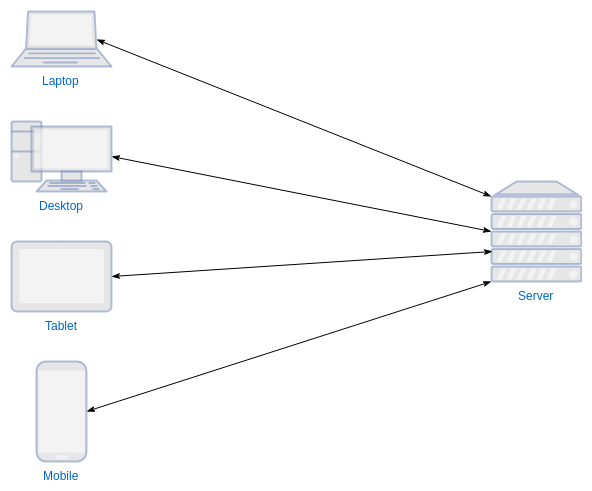
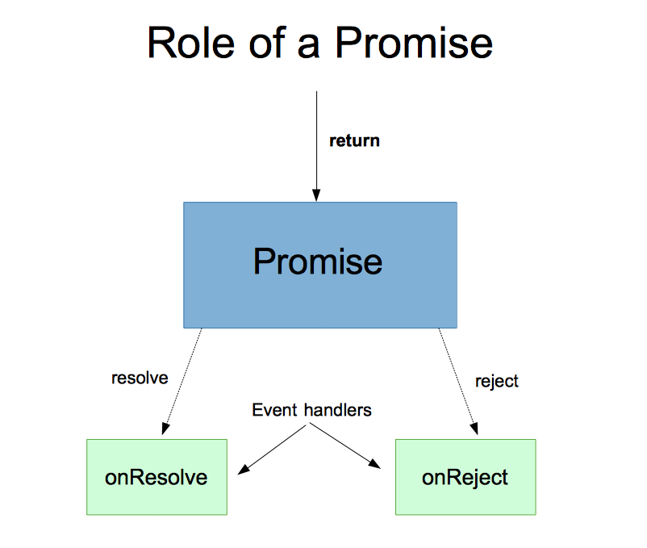

[](https://generalassemb.ly/education/web-development-immersive)

# Intro to Node, NPM, and Promises

Learn about server-side JavaScript with Node and NPM.

## Prerequisites

- JavaScript
- Command line
- Have Node and NPM installed

## Objectives

By the end of this, developers should be able to:

- Identify and discuss high-level differences between server-side and
  client-side JavaScript
- Import and export Node modules
- Use npm to install and manage dependencies in projects and globally
- Use Node to work with the file system
- Explain the advantages of using promises over callbacks.
- Rewrite node scripts using callbacks as scripts using promises.

## Preparation

1. Fork and clone this repository.
 [FAQ](https://git.generalassemb.ly/ga-wdi-boston/meta/wiki/ForkAndClone)
1. Create a new branch, `training`, for your work.
1. Checkout to the `training` branch.
1. Install dependencies with `npm install`.

## Introduction

Today, we're going to embark on the next leg of our journey in learning full
stack web development. So far, we've just learned to write client-side JavaScript
that is loaded into our browsers via an HTML file. There's another kind of 
JavaScript that we have yet to learn.

If we're not writing JavaScript _for_ our browsers to run, then what exactly are
we writing it for? You may have heard that Node is server-side JavaScript, but
why and how are we concerned with servers as web developers?

### Discuss

Turn to your neighbor and discuss the following questions:

- In plain English, what does a server do?
- Have we had exposure to any servers so far? Give some examples.

## The Role of the Server

The server provides as much functionality as we want it to. That can mean
performing really resource-heavy computation (like with large amounts of data),
reading and writing from a database, or responding to a request.

You don't want to do heavy-lifting in the browser, especially when dealing with
mobile devices, because those heavy-lifting tasks will require a lot of
resources. So, we put that code on the server.

In web development, the most common job of a _server_ is to **respond** to
_client_ **requests**. If a server application receives a request it can't
fulfill, it still provides a response. If a server doesn't respond with
anything, we'll assume that it is down or that something has gone wrong with our
connection.



There is a 'contract' between servers and clients where a _client makes requests
to a server_ and the _server responds to the request_. This is a paradigm known
as [request-response](https://en.wikipedia.org/wiki/Request%E2%80%93response).
The rules laid down by this paradigm enforce a standard baseline for a reliable
internet we've all come to enjoy.

In a practical sense, every time you visit a website (like `http://google.com`)
you're seeing what's been requested and returned from a server.

So far, all our applications have run entirely in the browser. We did deploy
them, so users could use our applications from anywhere. But, the code for our
application was only executed in their browser, with no connection to anyone
else using our application. Very, very few applications work like that in the
real world.

So how do we make applications in such a way that different users can interact
with each other through them from different clients?

We use a server!

## What is Node?

Node is a server-side runtime of JavaScript.

What does that mean? To answer that, we have to rethink our understanding of
JavaScript.

Most programming languages have different versions of the language. As new
features are rolled out, they are released in a new version of the language.
JavaScript has this as well, but is unique in that JavaScript is run in multiple
different environments. So there isn't just one "JavaScript", there are many.

The implementations of JavaScript are different in different browsers, i.e. the
language is different in Chrome, Firefox, Internet Explorer, etc. Each
implementation follows the same specification, which is maintained and updated
by a central committee called TC39, but each vendor is in charge of their own
implementation.

While nowadays, these implementations are largely standardized, there are still
some differences. For instance, the `forEach` method is implemented on NodeLists
in all major browsers except Internet Explorer! So if you have some code that
runs something like `document.querySelector('.class').forEach()`, it will throw
an error on IE, because that browser doesn't have a method called `forEach`
defined on that object.

[Node](https://nodejs.org/), then, is just another implementation of the
JavaScript specification.

What's important about Node, though, and what makes it a little different from
the browser implementations, is that it is aimed at running JavaScript in a
server environment, not a browser!

That means there are some practical differences in how we write JavaScript in
Node versus for a browser. It also means there is a lot of server specific
functionality that will only work in Node. Try `console.log(this)` in Node and 
in the browser.

## Code Along: Your First Node Application

We're going to explore working with Node and npm in a new directory.

### Instructions

1. Navigate to up a level in your filesystem to your `trainings` directory. 
1. Create a new directory called `hello-node` and `cd` into it.
1. Create a file called `index.js` and edit it in your text editor.
1. Console log 'hello world'.
1. Create an array with at least three items, assign it to a variable, and
   console log it.
1. Create an object with at least two properties, assign it to a variable, and
   console log it.
1. Write a DOM method like `document.querySelector()` and see what happens.
1. In your command line and enter the command `node index.js`. Make sure you're
   in the same directory as the file you're trying to run.

**Review Questions:**

- What does the `node` command do?
- What happens with `document`? Can we fix that?
- What if you type `node` just by itself?

## Working with Modules and Dependencies

We use npm and the `package.json` file it creates to manage our project. Most
importantly, we use it to manage **project dependencies.**

Dependencies are modules or libraries of code, separate from our application,
that our application relies on in order to function. It's a way for us to reuse
code, either written by ourselves or someone else.

The `package.json` file is used to describe details about our project - one of
those details is the project's dependencies. They're stored in a key in the file
called `dependencies`!

Here's what a typical `package.json` dependency might look like for a
medium-sized project:

```json
"dependencies": {
  "bcrypt-nodejs": "0.0.3",
  "body-parser": "^1.18.2",
  "connect-flash": "^0.1.1",
  "cookie-parser": "^1.4.3",
  "express": "^4.16.2",
  "express-session": "^1.15.6",
  "hbs": "^4.0.1",
  "method-override": "^2.3.10",
  "mongoose": "^5.0.7",
  "passport": "^0.4.0",
  "passport-local": "^1.0.0"
}
```

### Discussion: node_modules and .gitignore

Let's say we want to work on someone else's project. We clone it down to our
computer, and then open it up and start exploring the file structure. You've
already done this with the first JS checkpoint.

It's got various javascript files, and also a `package.json` file describing all
the modules needed to run the code.

Since `package.json` is a list of all of our dependencies, where do those files
all actually live? In the `node_modules` folder. Wait - there's no
`node_modules` folder!

In order to **install** all of the dependencies, we run the command
`npm install` in the directory we cloned down. This command goes to the npm
server and downloads a bunch of javascript files and puts them into the
`node_modules` folder.

Since we have a list of dependencies in the `package.json` file, and anyone that
clones a project down can simply download all the dependencies, we don't want to
include them in our git history. This is where the `.gitignore` comes in.

### Instructions

> Still in your `hello-node` directory

1. In the command line, in your project directory, run:

```sh
npm install lodash
```

Note what happened. A folder called `node_modules` appeared!

Let's take a look at the `package.json` file that did appear. We have a small JSON object with just the `lodash` dependency but we are missing some very important parts still. Let's run the next command to get them too appear.

```sh
npm init
```

It should already have a dependency of `lodash` in it, from the previous
`npm install lodash` command.

We don't want git to track all the node modules files. There are way too many
and it bloats the size of our project.

Let's set up a new git project in this directory.

```sh
git init
```

2. Create a file called `.gitignore` in the root of your project directory.

   > `touch .gitignore`

3. Open `.gitignore` and type `node_modules` into it.

4. You're done!

You can put the names of any files or folders in the `.gitignore` file. They
will all be ignored. They won't be deleted from git though - you must use
`git rm` for that. For example, if you previously committed a `node_modules`
folder, adding it to `.gitignore` doesn't delete the folder. It simply stops
paying attention to it.

Don't know what you want to include in your `.gitignore` file? You can use a git ignore template site like [toptal.com](https://www.toptal.com/developers/gitignore)

5. In `index.js`:

```js
const _ = require("lodash");

const variousBrownBears = [
  'Atlas bear',
	'Bergman\'s bear',
	'Blue bear',
	'Eurasian brown bear',
	'European brown bear',
	'Gobi bear',
	'Grizzly bear',
	'Himalayan brown bear',
	'Ussuri brown bear',
	'Kamchatka brown bear',
	'Kodiak bear',
	'Marsican brown bear (critically endangered)',
	'Mexican grizzly bear',
	'East Siberian brown bear',
	'Syrian brown bear'
]

const randomBear = _.sample(variousBrownBears);
console.log(randomBear);
```

6. Run `node index.js` from your terminal. 


**Review Questions:**

- In your own words, describe what we just did

### Discussion: process.argv

We'll frequently need to pass some input into the scripts that we write with
Node. Think about `code .` or `code text.txt`, for example. It's not written in Node,
but it is essentially a script that accepts arguments from the command line. It
wouldn't be very useful if we couldn't tell it what to open! When we open files
or folders in VSCode we pass in a path to that file or folder as an _argument_.
Let's take a look at `bin/process-argv.js` to get a sense of how arguments
work in Node.

## Working With the File System

One of the key advantages to working on the server is being able to work with
the file system. Working with the file systems is especially handy if we're
using Node to build command line applications, which we can do because Node is
not confined to the browser!

Node comes with a module, called
[fs](https://nodejs.org/dist/latest-v10.x/docs/api/fs.html), for working with
the file system.

### Code along: Write to a file

Still inside your `index.js` with `variousBrownBears` we'll start by exploring how to create (i.e. write) files using Node. The method
for doing so is part of the `fs` module and is called `writeFile`.

> Documentation for
> [fs.writeFile](https://nodejs.org/api/fs.html#fs_fs_writefile_file_data_options_callback)

Update your `index.js` file with this code snippet:

```js
const fs = require("fs");

/* 
fs is the node filesystem module. We're importing it from the node standard library, which is always in scope (part of the standard node modules), so we don't provide a path at the beginning of the line.
*/

fs.writeFile("./file.txt", "hello world", err => {
  if (err) {
    console.error(err);
  } else {
    console.log("done");
  }
});
```

Let's break this down:

1. We first import `fs`, and save it to a variable using `require()`
1. The first argument is the path and name of the file we want to write
1. The second argument is the data we want to write. In this case, just a string
   that says `hello world`
1. The last argument is a `callback` function, or a function that runs when the
   writing is complete

Go ahead and run this file in your terminal by typing `node index.js`.

#### Discuss

Turn and discuss what just happened with your neighbor.

### Code along: Read From a File

So, we've written some data to a file. How can we get the contents of it?

Comment out the code to for `writeFile` and add the following below:

```js
fs.readFile("./file.txt", "utf8", (err, data) => {
  if (err) {
    console.error(err);
  } else {
    console.log(data);
  }
});
```

This looks very similar to the `writeFile` syntax, but with some different
arguments:

1. Argument 1 is the path to the file we want to read
1. Argument 2 is the `encoding` of the file. If you don't specify the encoding,
   what happens?
1. Argument 3 is the callback function again. It takes two arguments: `error`
   and `data`.

This is great and all, but can't we do more than hello world? Why yes, yes we
can.

### Code along: Parsing & Stringifying JSON

Let's create a file called `heros.json` and copy and paste the following JSON.

```json
{
    "mage": {
        "health": "10",
        "damage": "20"
    },
    "fighter": {
        "health": "20",
        "damage": "10"
    },
    "thief": {
        "health": "15",
        "damage": "15"
    }
}
```

Now let's read from the `heros.json` and console log our heros. 

```js
fs.readFile('./heros.json', 'utf8', (err, data) => {
	if (err) {
		console.error(err)
	} 
// converts JSON into a pojo
// pojo = plain old JavaScript object
    const heroPojo = JSON.parse(data)
    const herosJson = JSON.stringify(heroPojo)
	console.log(herosJson)	
})
```

When we console log `herosJson` we will see something like this:

```js
{"mage":{"health":"10","damage":"20"},"fighter":{"health":"20","damage":"10"},"thief":{"health":"15","damage":"15"}}
```

Now we can take this and write it into a new file. Still inside our `fs.readFile` function we want to add: 

```js
fs.writeFile('./newHeros.json', herosJson, (err) => {
	if (err) {
		console.error(err)
	}
	console.log('done')
})
```

Run the script again in your terminal, and check the results in `newHeros.json`.

This is great! But our results are not as pretty as our original JSON. Let's make it add some extra arguments to our `JSON.stringify()` method to fix this issue.

```js
// convert heroPojo into json, 2 specifies how many spaces to indent the object
// allows the JSON to be formatted with newlines
const heroJson = JSON.stringify(heroPojo, null, 2)
```

Now that we can read from a file and write to another file lets make this code reusable.

Let us first wrap our code in a function so that way we can export it and use it elsewhere. 

```js
const readAndWriteJSON = () => {
  fs.readFile('./heros.json', 'utf8', (err, data) => {
    // ...
    fs.writeFile('./newHeros.json', herosJson, (err) => {
      // ...
    })
  })
}

module.exports = readAndWriteJSON
```

Now that we have our read and write file in a function lets replace our hard coded in and out file with variables that we have declared in as arguments. 

```js
const readAndWriteJSON = (inFile, outFile) => {
  fs.readFile(inFile, 'utf8', (err, data) => {
    // ...
    fs.writeFile(outFile, herosJson, (err) => {
      // ...
    })
  })
}
```

Great, but now if we run it nothing happens! Lets create a new file and this will be the access point for this code.

From your `hello-node` directory create a new file called `run-read-and-write.js`

Inside your `run-read-and-write.js` lets first require the `readAndWriteJSON` function we just wrote.

```js
const readAndWriteJSON = require('./index')
```

Next lets use the `process.argv` to grab values from the command line when we run this with node.

```js
const inFile = process.argv[2]
const outFile = process.argv[3]
```

Note that we are starting out at the second index which is the third argument that we are going to pass in. The first being `node`, the second being the file we want to run.

After we have those inputs now save to variables we can pass them to our `readAndWriteJSON` function. 

```js
readAndWriteJSON(inFile, outFile)
```

But wait! What is the user doesn't pass in any arguments. We don't want to have our function run. Let's put a check to see if an in file or an out file was passed in.

```js
if (!inFile && !outFile) {
	console.log('You are missing your inFile or your ourFile')
} 
```

## JavaScript Promises: Why Promises?

Promises are an alternative to directly using callbacks. Promises allow us to write asynchronous code that looks like synchronous code. Promises create the illusion of returning values or throwing errors from within our callbacks. While promises do not replace callbacks--promises depend on callbacks--they provide a layer of abstraction between you and callbacks, enabling you to prevent callback hell.

### Anatomy of a Promise



### Role of a Promise

A promise represents a value that will be available for use in the future, 
but is not available now. Think of it like an IOU for the actual value. Once
it **resolves**, it will pass the value it's standing in for to a function you
provide for it to invoke. Like an IOU, it can also "bounce", or **reject**, and 
fail to provide the value it's standing in for. Promises also provide a way to 
deal with this possibility.

### `Promise.then` and `Promise.catch`

These two methods on every `Promise` object are the primary means of interacting
with them. This section covers what they have in common.

They can be used the same way. Each takes one argument, a function. Here is a
usage example featuring an arbitrary promise, `somePromise`:

```js
somePromise.then(function(resolutionValue) {
    console.log("somePromise resolved with value " + resolutionValue);
    doSomethingWith(resolutionValue);
});
```
```js
somePromise.catch(function(rejectionValue) {
    console.error(rejectionValue instanceof Error ?
        rejectionValue :
        "somePromise rejected with value " + rejectionValue);
});
```

#### `.then`

`then` is a method on every `Promise` object. It is used to register an event
handler for the promise's "resolve" event. When the promise resolves, the handler
is invoked and passed the value the promise resolved to as its argument.

#### `.catch`

`catch` is a method on every `Promise` object. It is used to register an event
handler for the promise's "reject" event. When the promise rejects, the handler
is invoked and passed the value (usually an `Error` object) the promised rejected
with as its argument.

### Code along: Convert `readAndWriteJSON` to use a promises

Inside of the `hello-node` directory lets take another look at `index.js`. We have a function `readAndWriteJSON` that is currently using only using callbacks. Let convert this over to use promises.

Lets make a two new functions bellow the `readAndWriteJSON` and have them both return a `new Promise`

```js
const readAndWriteJSON = (inFile, outFile) => {
  // ...
}

const readFile = () => {
  return new Promise((resolve, reject) => {
    
})
}

const writeFile = () => {
  return new Promise((resolve, reject) => {
    
})
}
```

Notice that we are returning the `new Promise` on the same line that we declare it. This will make use able to `.then()` and `.catch()` methods once we call these functions.

Now that we have our functions declared we can now `resolve` or `reject` our data. Lets do that.

```js
const readFile = (inFile) => {
	return new Promise((resolve, reject) => {
		fs.readFile(inFile, 'utf8', (error, fileData) => {
			if (error) {
				reject(error)
			}

			resolve(fileData)
		})
	})
}

const writeFile = (outFile, json) => {
	return new Promise((resolve, reject) => {
		fs.writeFile(outFile, json, (error) => {
			if (error) {
				reject(error)
			}

			resolve(json)
		})
	})
}
```

1. `readFile` we declare the parameter `inFile`, and in `writeFile` we declare `outFile` and `json` just like we did when we were using callback.
2. In both of these promise functions we `reject` if an error occurs. This sends the error to our `.catch()`
3. In both we also `resolve` either the `fileData` or `json` which sends that information onto the next `.then()` in the promise chain. 
   
But oh no!! We are missing the code that parses our JSON to a pojo and then back to JSON. Lets create a helper function that contains that code. 

```js
const parseJson = (json) => {
  const heroPojo = JSON.parse(json)
  const herosJson = JSON.stringify(heroPojo, null, 2)
	
  return herosJson
}
```

Be sure to return here! We don't want to break the promise chain and no longer have access to our data in our `writeFile` function. 

Now lets export these new functions so we can use them over in `run-read-and-write.js`

```js
module.exports = {
  readFile,
  writeFile,
  parseJson
}
```

Head over to `run-read-and-write.js` and lets make a promise chain. Comment out our original line of `readAndWriteJSON(inFile, outFile)` and under that write:

```js
readAndWriteJSON.readFile(inFile)
  .then(readAndWriteJSON.parseJson)
  .then(json => {
    readAndWriteJSON.writeFile(outFile, json)
  })
  .then(() => console.log('copied!'))
  .catch(err => console.error(err))
```

1. We start the chain by calling our `readFile` function. This returns a promise so now we can add our `.then()s` and `.catch()` methods.
2. In our first `.then()` we call our helper function `parseJson`. What is happening here? If our `readFile` function was able to `resolve` the data it will return that files contents. That is being passed to the `parseJson` function.
3. In our next `.then()` we kick off another promise! Here since we want to pass our `writeFile` function multiple arguments we can declare the return value that came from our last `.then()` as a parameter in an anonymous arrow function. Now that it is declared we can call our `writeFile` function and pass it the `outFile` and `json` that we need.
4. Our last `.then()` is just there to let us know that we were successful in the copy.
5. Last but not least we have our `.catch()`. Even though there is two promises in this chain we just need the one `.catch()`. If an error does occur in either it will fall through to this one `.catch()`

### Lab: Promisify callbacks

#### Promisify hey-yall.js

Inside `lib/hey-yall.js` there is a function that intakes an in file and console logs the contents of `data/names.txt` with `Hey` at the beginning. To run this file you need use the entry point in `bin/hey-yall.js`. This is already working code. To run please use:

```sh
node bin/hey-yall.js data/names.txt 
```

Goals:
1. Read through both files and comment in your words what each line does.
2. Modify the code to use promises.

## Additional Resources

- [Node.js Documentation](https://nodejs.org/en/)
- [Rising Stack](https://blog.risingstack.com/) - A really great resource for
  Node

## [License](LICENSE)

1. All content is licensed under a CC­BY­NC­SA 4.0 license.
1. All software code is licensed under GNU GPLv3. For commercial use or
   alternative licensing, please contact legal@ga.co.
