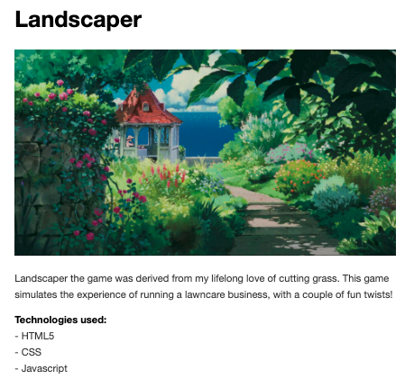
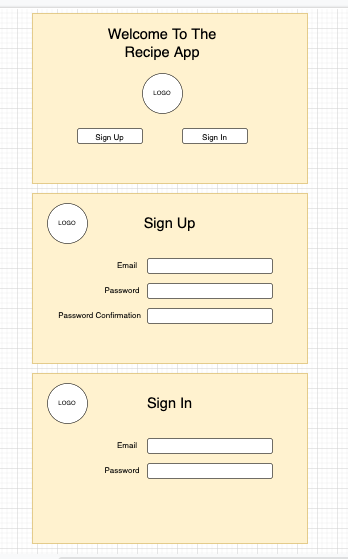
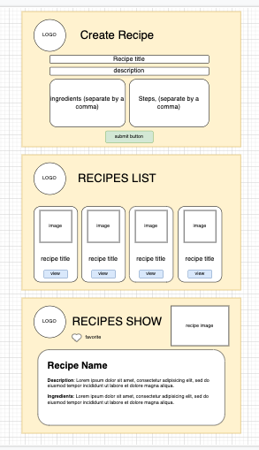
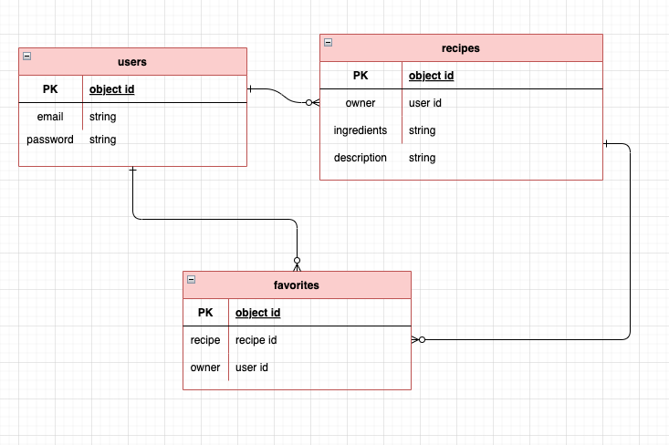

[](https://generalassemb.ly/education/web-development-immersive)

# Planning a project

## Objectives

By the end of this, developers should be able to:

-   Draft a brief overview of the general project idea.
-   Write user stories for a project.
-   Create wireframes that map the user experience.
-   Create Entity Relationship Diagrams.

## Preparation

1.  Create a new repository for your game on your personal github.
1.  Create a README.md file in the new repo.


## Planning a Project

Planning is crucial to a successful project completion. Here, we'll break down the planning process in a way that will help you develop an idea into a complete project.

## Start with a README

README.md is the file that displays on your github repository's landing page.

Your README should document your project as well as your planning process. This is designed to give your users an overview of how to interact with your project, and to describe the planning process you used to take your app from an idea to a finished product.

##### Your README should be broken down into the following parts:
  - Overview
    - a brief description of your application
  - User Stories
    - a detailed list of the functionality of your application, told through a user's perspective
  - Wireframes / Screenshots
    - diagrams that display what your application will look like, and images from the completed app.
  - Entity Relationship Diagrams
    - diagrams that describe the relationships between your resources

## Overview

Describe your project in a few brief sentences. The description should be short and sweet, covering the basics of the project, a brief history of the project, and a list of technologies used in the project. Sometimes this portion contains a picture for added effect, like a screenshot, or an image related to the overall idea. Here's an example:



Your descriptions should be a little longer than the example above, but not so long that you describe every single aspect of the project.

## User Stories

User stories detail every action that a user can take, from the user's perspective. These aid in describing the application to the person reading the `README.md`, and are useful in creating a roadmap, or a checklist, that you can follow while you build your application. User stories are formatted as a list and are typically written starting with "As a user, I want to..." and ending with a description of an action. 

Here's an example of some user stories for a recipes application:
```
  - As a user, I want the ability to sign up.
  - As a user, I want the ability to sign in. 
  - As a user, I want the ability to change my password. 
  - As a user, I want the ability to sign out. 
  - As a user, I want the ability to create my own recipes. 
  - As a user, I want the ability to update my recipes. 
  - As a user, I want the ability to view all of my recipes in a list. 
  - As a user, I want the ability to read more details of individual recipes. 
  - As a user, I want the ability to delete my recipes. 
  - As a user, I want the ability to view recipes others have created. 
  - As a user, I want the ability to favorite recipes that other people have created. 
  - As a user, I want the ability to read all of the recipes I have favorited. 
  - As a user, I want the ability to remove recipes from my favorites. 
```
User stories are where you can really dive into detail on the functionality of your application. While the above example is pretty much an industry standard, it's also alright to write your user stories with the following format:

```
As a user, I want the ability to... 
  - sign up.
  - sign in. 
  - change my password. 
  - sign out. 
  - create my own recipes. 
  - update my recipes. 
  - view all of my recipes in a list. 
  - read more details of individual recipes. 
  - delete my recipes. 
  - view recipes others have created. 
  - favorite recipes that other people have created. 
  - read all of the recipes I have favorited. 
  - remove recipes from my favorites. 
```


## Wireframes / Screenshots

The wireframes section is to show off your planning process for the visual component of your application. Wireframes are diagrams that detail the way your application should look. Using an online whiteboarding tool, or a a pencil and paper, or some combination of the two, you should create wireframes for every page you want to build in your application. If you use your user stories as a guide, it can be a very quick process that cuts a lot of the guesswork out of the actual building of your app!
It's ok to keep these simple, as they're meant to be a guide for you rather than an example of the finished product. 

See the two examples below, that could serve as wireframes for an app that follows the user stories from the previous section:




Notice how these are using descriptions on the items displayed that describe the various parts of the webpage. These aren't nearly enough wireframes for a project that has this many user stories, but it's a good start. 

## Entity Relationship Diagrams (ERDs)

Entity relationship diagrams are designed to show off the relationships between your application's resources. We'll cover these more in depth when we talk about databases and relationships, but you can think of these as a description of all the objects in your app as well as how they relate to one another. If we were to make an ERD of our recipe example above, it might look something like this:



Notice how the entities are connected to one another with lines that describe the type of relationship between them, and each entity has a description of its parts.
<!-- 
If you're not using a database, for instance, if you're building a simple browser game, you can use this section to talk about the different elements of your game and how they interact. This could include a list of objects, classes, or functions you'll be using to make your game successful. Again, this is a general overview that shouldn't detail every single thing that hapens in your app, but an overview of the more important aspects.

For example, below are descriptions of some objects and methods we used in canvas crawler, you can document these with the actual class/object you used, or you can use a general description like below:

```
Hero: {
  x: (x location on the canvas)
  y: (y location on the canvas)
  height: (should be smaller than ogre)
  width: (should be smaller than ogre)
  color: blue
  alive: (a boolean that determines if game is in progress)
  render: (a method that displays the hero on the screen)
}

Ogre: {
  x: (x location on the canvas)
  y: (y location on the canvas)
  height: (should be taller than hero)
  width: (should be wider than hero)
  color: green
  alive: (a boolean that determines if game is in progress)
  render: (a method that displays the ogre on the screen)
}

function - gameloop - holds the entire logic that runs the game
function - detectHit - used to see if items have collided with one another
function - movementHandler - used to move the hero around, should be attached to arrow or wasd keys
``` -->

<!-- ## Additional Resources

-   Any useful links should be included in the talk material where the link is
    first referenced.
-   Additional links for further study or exploration are appropriate in this
    section.
-   Links to important parts of documentation not covered during the talk, or
    tools tangentially used but not part of the focus of the talk, are also
    appropriate. -->

## [License](LICENSE)

1.  All content is licensed under a CC­BY­NC­SA 4.0 license.
1.  All software code is licensed under GNU GPLv3. For commercial use or
    alternative licensing, please contact legal@ga.co.
